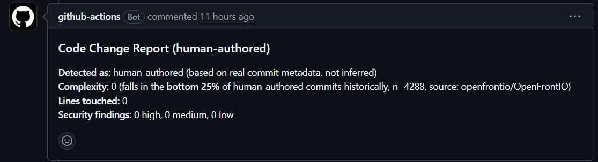
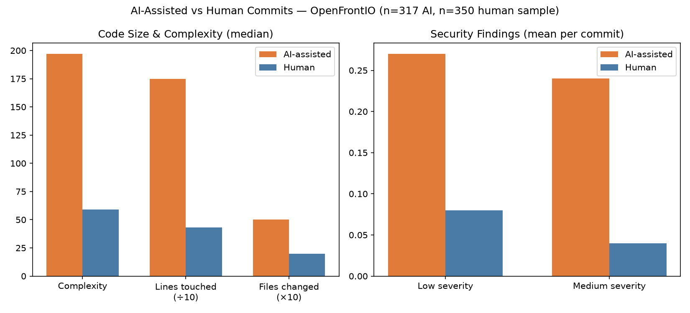

# AI-Generated Code Risk Analysis

**Does AI-assisted code actually carry more risk than human-written code — and can that be measured with real evidence instead of assumed?**

This project mines real, public GitHub history to answer that question directly, then ships a live GitHub bot that reports the finding automatically on real pull requests.

---

## The problem

AI coding tool adoption is now near-universal, but trust in the code it produces has been falling. One industry survey found AI tool usage reached 84% of developers while trust in the accuracy of that output dropped from 40% to 29% year over year. Research analyzing millions of lines of code found the share of duplicated code climbed from about 8% to over 12% of all changes between 2020 and 2024, and pull requests with AI-assisted code show 1.7x more issues than human-written code, with organizations reporting technical debt increases of 30–41% within six months of AI tool adoption.

That's a real, current, expensive, and largely unmeasured problem. This project measures it directly, on a real codebase.

## What this project actually does

Two connected pieces of work:

### 1. A general code-risk classifier (`psf/requests`)
Mines real commit history from the `requests` Python library, uses the SZZ algorithm to trace bug-fixing commits back to the commits that actually introduced the bug (real historical ground truth, not guessed labels), engineers features (code complexity, near-duplicate detection via CodeBERT embeddings, static-analysis security findings), and trains a classifier to flag risky commits. Includes SHAP-based explainability so every flagged commit comes with a "here's why," not just a number.

### 2. A real AI-vs-human comparison, with a live reporting bot (`OpenFrontIO`)
The more direct answer to the original question. Real AI coding tools (Claude Code, GitHub Copilot, etc.) leave genuine, literal markers in commit history (`Co-Authored-By: Claude`, `Generated with Claude Code`, etc.) — this project mines a real, popular open-source project ([OpenFrontIO](https://github.com/openfrontio/OpenFrontIO), 2,600+ stars) for commits carrying these real markers, and statistically compares them against human-written commits on complexity, size, and real static-analysis security findings.

A GitHub Action bot then uses this real baseline to automatically report, on any new pull request, whether the change is AI-assisted, and how its complexity and security profile compares to real historical patterns.

## The real finding

Comparing 317 real AI-assisted commits against a sample of human commits in OpenFrontIO's history:

| Metric | AI-assisted (median) | Human (median) | Significant? |
|---|---|---|---|
| Code complexity | 197 | 59 | Yes (p < 0.0001) |
| Lines touched | 1,749 | 430 | Yes (p < 0.0001) |
| Files changed | 5 | 2 | Yes (p < 0.0001) |
| Medium-severity security findings (mean) | 0.24 | 0.04 | Yes (p = 0.0003) |

AI-assisted commits in this real project are substantially larger, more complex, and carry more real static-analysis findings than human-written commits — a measured, statistically significant result, not a repeated industry statistic.

**Honest caveat:** this shows correlation, not proof of causation. It's equally plausible that developers reach for AI specifically on larger, more sweeping changes, rather than AI inherently writing worse code for equivalent tasks. Both are consistent with the data; distinguishing them is a natural next step (e.g. normalizing findings per line changed).

## Architecture